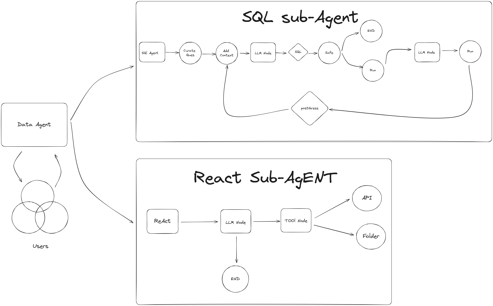
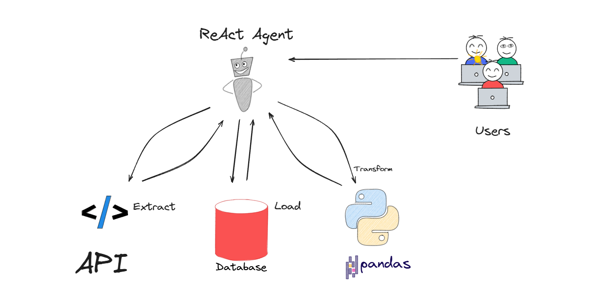
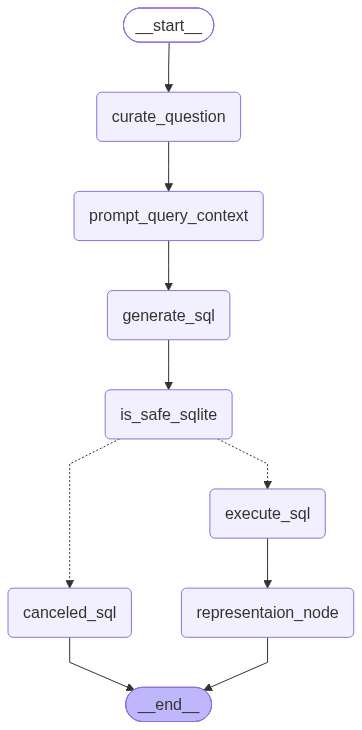
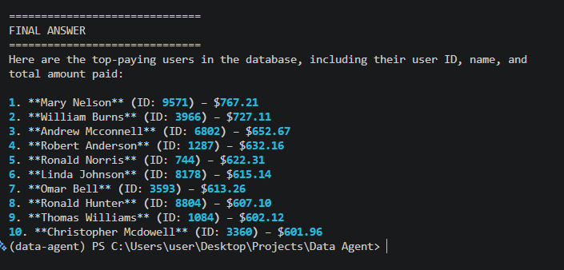

# Data Agent

A multi-agent data workflow built with Python, LangChain, LangGraph, and SQLite. This project combines an ETL analyst and a SQL analyst behind one routing agent so a user can ask either for data extraction or database querying through a single interface.

## Project purpose

The project is designed to help with two main tasks:

1. Extract data from public APIs and store it locally in CSV, JSON, or parquet format.
2. Convert natural-language questions into SQLite-safe SQL, validate the query, and return an answer based on the database.

This makes the project useful for quick demos, lightweight analytics, and AI-assisted data workflows.

## Architecture overview

The system uses a router agent to decide which specialist should handle the request:

- ETL Analyst: handles API extraction and transformation tasks
- SQL Analyst: turns plain English into SQL and executes safe read-only queries
- Main Data Agent: routes user questions between those specialist agents

## Project gallery

### High-level system design



### Agent workflow design



### Routing graph


### ETL workflow graph


### SQL workflow graph



### Output examples



## Project structure

```text
Data Agent/
├── agents/
│   ├── data_agent.py
│   ├── etl_analyst.py
│   └── sql_analyst.py
├── csv_data/
│   ├── payments.csv
│   ├── ratings.csv
│   ├── rides.csv
│   ├── users.csv
│   └── vehicles.csv
├── data/
│   ├── agent.db
│   └── extracted_data.json
├── models/
│   └── schema.py
├── utils/
│   ├── create_db.py
│   ├── database.py
│   ├── etl_tools.py
│   ├── feed_dabase.py
│   └── llm_pick.py
├── app.py
├── main.py
├── README.md
├── requirements.txt
├── pyproject.toml
├── .env
├── Architecture.png
├── ReAct_Agent_Architecture.png
├── data_agent_graph.png
├── etl_analyst_graph.png
├── sql_analyst_graph.png
├── SQL_Analyst_Result.png
└── test_schema_details.txt
```

## Main components

### 1. ETL Analyst

The ETL workflow is implemented in `agents/etl_analyst.py` and uses tools to:

- download data from an API
- save it to a chosen folder
- write CSV, JSON, or parquet files
- transform extracted data using generated pandas code

This is helpful for quick data ingestion tasks such as:

- download a list of Pokémon from the PokeAPI
- store the results locally
- prepare them for analysis

### 2. SQL Analyst

The SQL workflow is implemented in `agents/sql_analyst.py` and includes:

- question curation
- database schema context injection
- SQL generation
- safety checks to ensure the query is read-only
- execution against the SQLite database
- final answer composition

### 3. Router/Orchestrator

The main orchestration layer is in `agents/data_agent.py`.

It decides which specialist should handle the request:

- `etl` for extraction / transformation tasks
- `sql` for database questions

## Database setup

The SQLite database is created from CSV files in `csv_data/` using `utils/create_db.py`.

This prepares the `agent.db` file inside the `data/` folder.

## How to run the project

### 1. Create and activate a virtual environment

```bash
python -m venv .venv
source .venv/bin/activate
```

On Windows PowerShell:

```powershell
python -m venv .venv
.\.venv\Scripts\Activate.ps1
```

### 2. Install dependencies

```bash
pip install -r requirements.txt
```

or with the project environment:

```bash
pip install -e .
```

### 3. Create the database

```bash
python utils/create_db.py
```

### 4. Start the frontend UI

```bash
streamlit run app.py
```

### 5. Run the CLI version

```bash
python -m agents.etl_analyst
```

or:

```bash
python -m agents.data_agent
```

## Example usage

### ETL request

> Extract data from https://pokeapi.co/api/v2/pokemon?limit=10 and save it in JSON format in the data folder.

### SQL request

> Give me the top payment-giving users in the database.

## Notes

- The SQL workflow is intentionally restricted to read-only queries for safety.
- The ETL workflow stores outputs in the local project folder for demonstration or experimentation.
- The frontend is designed to showcase the project clearly for presentations and demos.

## Technologies used

- Python
- SQLite
- LangChain
- LangGraph
- Streamlit
- Pandas
- dotenv
- Pydantic

## Contributor notes

The project is easy to extend with more specialist agents, additional data sources, or a richer UI. The router pattern is already in place to support new workflows without rewriting the core orchestration.
